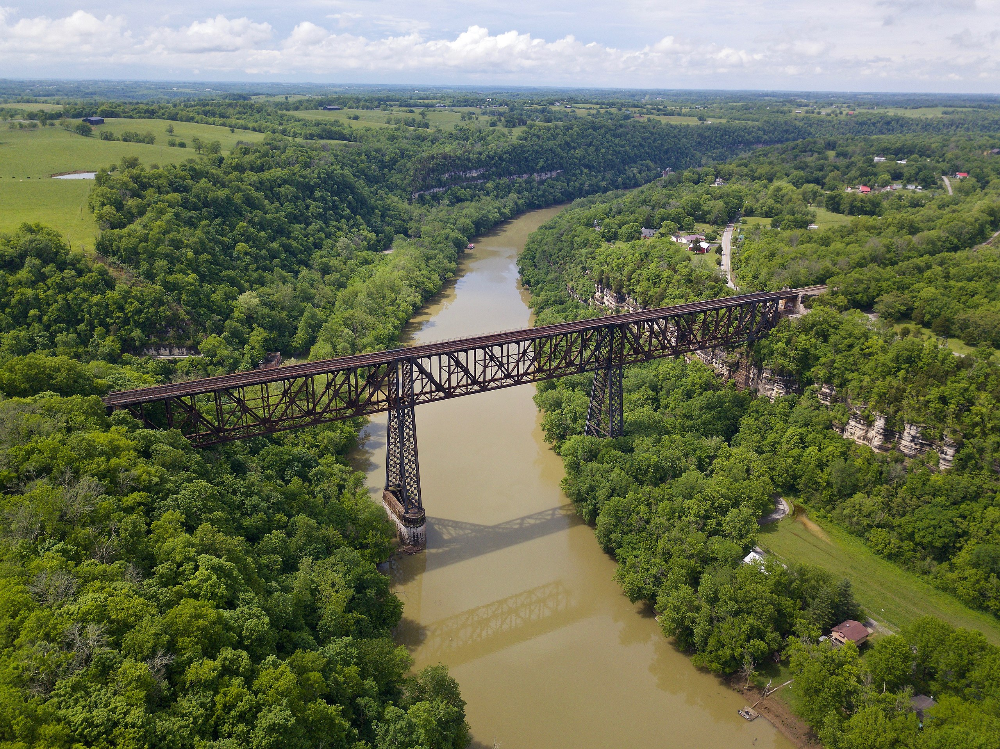
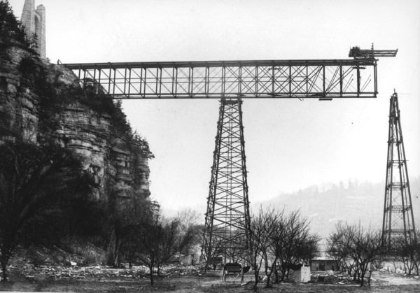
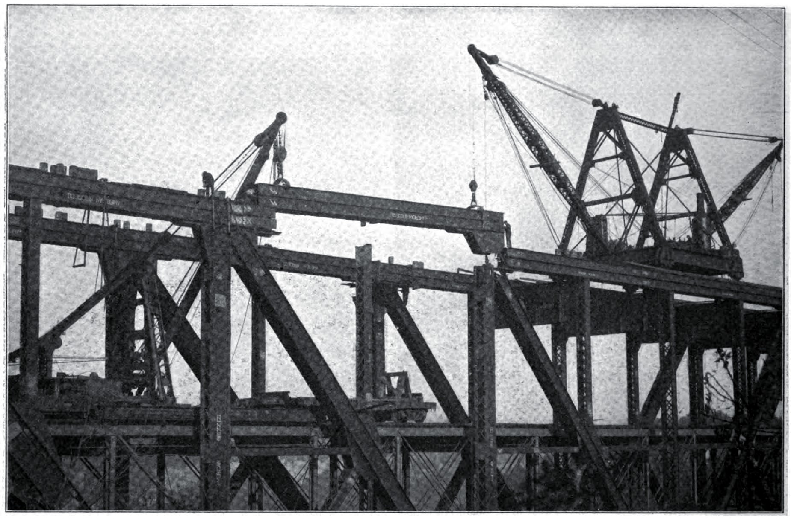
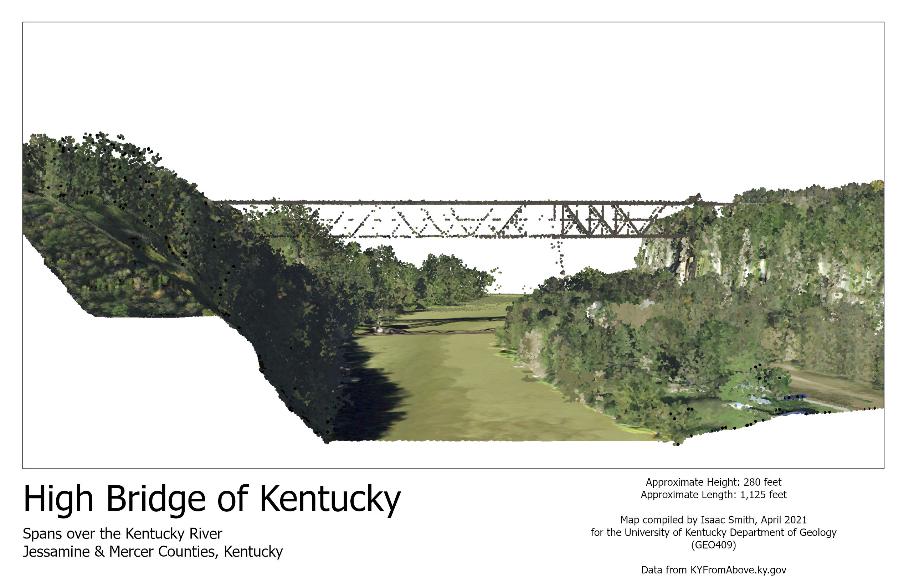

# High Bridge, Kentucky

## A Present-Day Image of High Bridge, Kentucky

*Wikipedia Image, accessed May 2021*

## Introduction
High Bridge was originally constructed in the 1870's as a means of transportation across the Kentucky River for the Cincinnati Southern Railroad. Because this was the first cantilever bridge built in America, it is said to be the "beginning of modern scientific bridge building."
The bridge rises approximately 280 feet over the Kentucky River, making it the tallest bridge in the world at the time of its construction. It connects Jessamine and Mercer Counties by crossing the river around the Kentucky Palisades. In addition, the bridge has been designated as a National Civil Engineering Landmark. Today, visitors come from all ove the state, country, and world to see this remarkable feat of engineering. There is a nearby park on top of the Palisades that features a picnic area, playground, and viewing platform.

Goals of this project include:
* mapping the surrounding area in high-resolution aerial lidar data,
* measuring height and length of the feature,
* visualizing the surrounding topography of the Palisades,
* comparing the lidar data with real-life images,
* and learning about the history of High Bridge.

## High Bridge During Construction

#### These are images of the bridge during early construction. Notice the cantilever trusses!

*Archive Project Image, accessed May 2021*

*Engineering Record Image, Volume 62, 1910, accessed May 2021*

## A Lidar Image of High Bridge, Kentucky

#### Look at the steep Kentucky Palisades on both sides of the river!

*Lidar Image, produced by Isaac Smith, 2021*

## An Animation of High Bridge, Kentucky

    
*([Watch Video](https://www.youtube.com/watch?v=EQ29kmdPV54))*
*YouTube Video, produced by Isaac Smith, 2021*

## A Site Map of High Bridge, Kentucky

#### Contour Intervals of the Surrounding Area

*([View Site](https://issm224.github.io/highbridgeky/site-map/))*
*Mapbox Site Map, produced by Isaac Smith, 2021*

## A Tour of High Bridge, Kentucky

*([Take Tour](https://issm224.github.io/highbridgeky/tour/))*
*Cesium Ion Tour, produced by Isaac Smith, 2021*

## Sources and Tools

Elevation data was acquired from the Kentucky's Elevation Data & Aerial Photography Program ([KyFromAbove.ky.gov](http://kyfromabove.ky.gov)).
LIDAR and digital surface model tools were used to process and analyze the data for the project. This can be found using [ArcGIS Pro](https://www.esri.com/en-us/arcgis/products/arcgis-pro/resources).

## About the Project
This project was completed as the final portfolio for GEO409 at the University of Kentucky. The project was compiled and completed by Isaac Smith on May 13, 2021. 